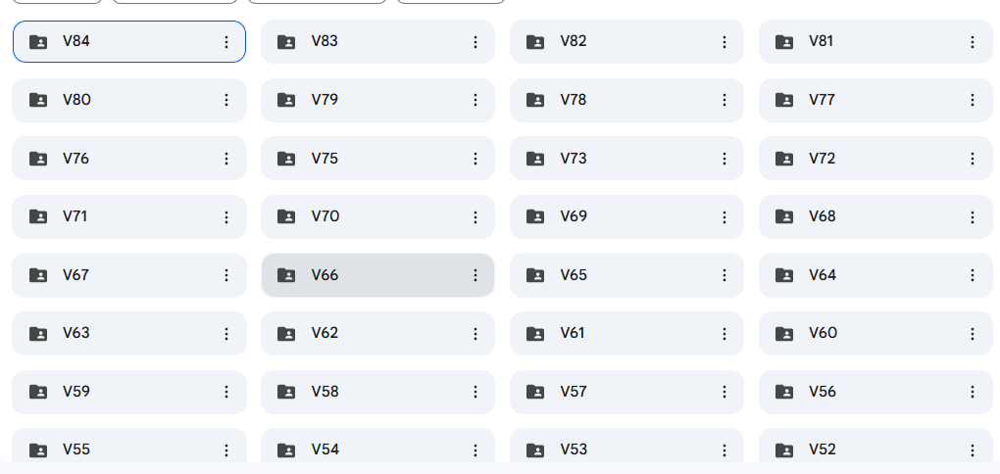

# Potatoes Classifier 🥔
  

App deployed using `streamlit` that uses a Random Forest model can predict the variety of a potato
> Final project of the machine learning subject at university 🎉


## Installation
Steps to Clone and Deploy the App Locally
1. **Clone the Repository**
Start by cloning this repository to your local machine. Open your terminal and run:
    ```bash
    git clone https://github.com/yourusername/your-repository-name.git
    Navigate to the project directory:
    cd your-repository-name
    ```
2. **Set Up a Virtual Environment (Optional but Recommended)**
It’s a good practice to use a virtual environment to manage project dependencies. If you're using *venv*, follow these steps:

    * Create a virtual environment:
    On macOS/Linux:

        ```bash
        python3 -m venv venv
        ```

        On Windows:

        ```bash
        python -m venv venv
        ```

    * Activate the virtual environment:

        On macOS/Linux:

        ```bash
        source venv/bin/activate
        ```

        On Windows:

        ```bash
        venv\Scripts\activate
        ```
3. **Install Dependencies**
After activating the virtual environment (or if you're using the system Python), install the required dependencies using pip:

    ```bash
    pip install -r requirements.txt
    ```
    This will install all the necessary libraries including Streamlit.

4. **Run the Streamlit App**
    To launch the app, run the following command:

    ```bash
    streamlit run app.py
    ```
    Note: Replace `app.py` with the actual filename of your Streamlit app if it's named differently.

    After running the above command, you should see the following:

    ```bash
    Local URL:  http://localhost:8501
    ```
    Visit `http://localhost:8501` in your web browser to view the app.

    ```bash
    pip install foobar
    ```

## Usage


## Data Collection

We visited Kaira, a place where our university preserves a wide variety of native potato species. During our visit, we captured over 4000 photos representing 84 different potato varieties. These images were later used to train various machine learning models. Among the models we tested, the Random Forest model performed the best, achieving approximately 75% precision.


It's imporatant to note that `rembg` was used to remove the background of each one of the pictures, this task was automated via python script


## Contributing
Feel free to fork the repository, open issues, and create pull requests. For any contribution, please follow these steps:

1. Fork the repository.
2. Create a new branch:
    ```bash
    git checkout -b feature-name
    ```
3. Commit your changes:
    ```bash
    git commit -am 'Add new feature'
    ```
4. Push the branch:
    ```bash
    git push origin feature-name
    ```
5. Create a pull request.

## License

[MIT](https://choosealicense.com/licenses/mit/)
